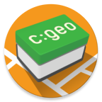

# c:geo

[c:geo](https://www.cgeo.org/) is an open-source, full-featured, always ready-to-go client for geocaching.com (unofficial).
It also offers basic support for other geocaching platforms.
It does not require a web browser or exports - just download and start right away.

## Want to contribute?

Perfect! Please **tell us in the [issue tracker](https://github.com/cgeo/cgeo/issues) before hacking** on your great new feature.
It would be bad for you to have implemented something great but we can't include it because it doesn't fit the existing architecture and code.

### Starting points for contribution

You can also take a look at the [project page](https://github.com/cgeo/cgeo/projects) of our repository.
For example, we have a collection of [urgent issues](https://github.com/cgeo/cgeo/projects/6) and a list of [beginner topics](https://github.com/cgeo/cgeo/projects/7).
They collect issues that might be suitable for your first contribution.

## Project status

 
 

## Get the source

**Fork** the [project source code](https://github.com/cgeo/cgeo), make changes to your clone, and [create a pull request](https://docs.github.com/en/free-pro-team@latest/github/collaborating-with-issues-and-pull-requests/about-pull-requests) afterwards.

Note: make sure to really **fork** the source code, **do not** just clone the main cgeo repository. Then work locally with a clone of your fork.
Otherwise you won't be able to bring your changes into cgeo later.
If you are a github / git beginner and don't know what this means, consult our [git/github setup page for beginners](https://github.com/cgeo/cgeo/wiki/Working-on-c%3Ageo-for-git-beginners).

### Branches

- `master` is for the development of new features. Nightly builds are created from this branch.
- `release` is for all bug fixes of already existing features. So if a bug is reported in a released version, it should be fixed on this branch (and merged to `master` afterwards).

Note: Regular merging of `release` to `master` (after changes have been done on `release`) is highly recommended to avoid unnecessary merge conflicts later on.

A more complex bugfix can first be tested against the `master` branch and integrated in the nightly builds while kept compatible with the `release` branch for a later integration.
Such a procedure is [described in the wiki](https://github.com/cgeo/cgeo/wiki/How-to-get-a-bug-fix-into-the-release).

## Setting up an IDE

The standard IDE for Android projects is Android Studio, which is based on IntelliJ IDEA.
We use it for the development of c:geo.

Details for setting up the IDE are described in the wiki (https://github.com/cgeo/cgeo/wiki/IDE).

## Build

### Prerequisites

- [Android SDK](https://developer.android.com/studio) (latest version) including Google APIs (at least) V26, Google repository, and Android support repository. (File => Settings, Appearance & Behaviour => System Settings => Android SDK, Check "Show Package Details" on "SDK Platforms" tab and check subpackages as needed.)
- If you use Microsoft Windows, [Google USB Driver](https://developer.android.com/sdk/win-usb.html) to install the application on the smartphone.
- You need to provide several API keys for compiling the app (see following sections for details).

### API keys

For the full usability of c:geo you need some API keys for Google Maps and the opencaching sites.
You can leave all entries in the configuration empty, but Google Maps and the Opencaching sites will not work.

For using the Google Maps function, it is necessary to have a Google Maps API v2 key. For this, follow
* [Maps SDK for Android: Get an API Key](https://developers.google.com/maps/documentation/android-sdk/get-api-key)

The key itself is free and you don't have to enter any credit card info (although the web form seems to force you to).

To be able to use Google Maps you need to use a Google API-enabled image, so make sure to select the right image for your emulator/device, otherwise Google Maps won't be offered as a map provider in c:geo.

Request your personal API key for the various [OpenCaching](https://www.opencaching.eu/) sites we support.
If you leave these blank, those networks will remain disabled.
* [opencaching.de OKAPI signup](https://www.opencaching.de/okapi/signup.html)
* [opencaching.pl OKAPI signup](https://opencaching.pl/okapi/signup.html)
* [opencaching.ro OKAPI signup](https://www.opencaching.ro/okapi/signup.html)
* [opencaching.nl OKAPI signup](https://www.opencaching.nl/okapi/signup.html)
* [opencaching.us OKAPI signup](https://www.opencaching.us/okapi/signup.html)
* [opencache.uk OKAPI signup](https://opencache.uk/okapi/signup.html)

To obtain an API key for [geocaching.su](https://geocaching.su/) you need to request access from [administration](https://geocaching.su/?pn=1).
Keys are generated manually on request.

### API keys installation

For c:geo we have a semi-automatic configuration:
1. Copy `./templates/private.properties` to `./`
2. Edit `private.properties` with your keys
3. The `./main/src/main/res/values/keys.xml` is created on the gradle build and filled with the data from `private.properties`

The third point works only if the file `keys.xml` does not exist.
When changing your API keys, you have to delete the `keys.xml` file.

If you want to fill the `keys.xml` by hand, copy `./main/templates/keys.xml` to `./main/src/main/res/values/`, then edit the copied `keys.xml`.
For each key, replace the value starting with `@` and ending with `@` (inclusive) with the key.
If a key is missing, remove the value and the leading and trailing `@`.

### Building with gradle

Run `gradlew` from the root directory of the git repository.
That will install the necessary build framework and display how to build c:geo.
`gradlew assembleBasicDebug` might be a good start.
Alternatively you can use "make" in Android Studio ("Build" => "Make Project").

To be able to create an installable Android package (APK), you need to create a signing key first.
In Android Studio go to "Build" => "Generate Signed Bundle & APK", select "APK", and follow the instructions.
You will create a key storage and a project-specific key.
Enter path and access information to those in file `cgeo/private.properties`.

### Testing

The Test classes can be found in the project test.
Test classes should be located in the same package as the class under test.
Every class can be run with `Run '<class name>'` or debugged with `Debug '<class name>'`) as an [Android JUnit Test](https://developer.android.com/training/testing/fundamentals.html).
To run all tests use the same `Run 'Tests in <package name>'` menu item from the context menu of a package in the test project.

For tests to run successfully you need to configure c:geo on the emulator that runs the test with a valid geocaching.com account.
In order for all tests to be successful the account needs to be a premium member.

Tests may also be launched from the command line.
Use `gradlew assembleBasicDebug` from the root directory of the git repository.

## Deploying the app locally for testing purposes

Android Studio needs to be configured for which device(s) c:geo will be deployed to. Use "run" => "run" (2nd entry with this heading).
You can create several profiles for a physical device attached via USB, as well as virtual devices that are run in an emulator.
(If the emulator is not installed yet, do so via File => Settings, Appearance & Behaviour => System Settings => Android SDK, tab "SDK Tools", check "Android Emulator", and apply.)

## License

c:geo is distributed under the [Apache License, Version 2.0](https://www.apache.org/licenses/LICENSE-2.0).

This product includes software developed by the c:geo team and contributors as well as parts developed elsewhere.
See the references in main/src/main/res/values/strings_not_translatable.xml for details (or "about: contributors" page in the app).

## Contact

- Website: https://www.cgeo.org/
- Support: support@cgeo.org
- Twitter: https://twitter.com/android_gc
- Facebook: https://www.facebook.com/android.geocaching
- Google Play: https://play.google.com/store/apps/details?id=cgeo.geocaching
- Live status: https://status.cgeo.org/
